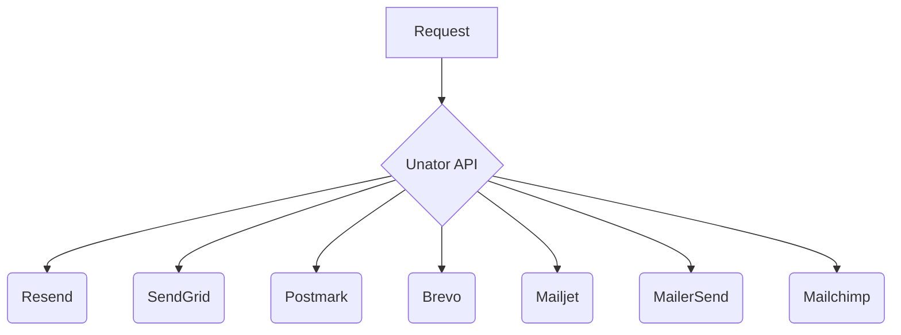

# Unator

> Like Hyperswitch, but for emails and storage.

Unator is Open Source infrastructure switch. Oriented on emails and storage.

- **Reduce costs** to start by leveraging free resources of services.
- **Reduce dependency** on single service with smooth migrations.
- **Improve uptime of services** by switching between them if one goes down.
- **Reduce Dev effort**, API is straightforward and require no effort to switch to another service.
- **Trusted and transparent** as Open Source project.

## Emails

Email services are our first goal and reason why unator has been started.

| Service    | Supported | Stage      |
| ---------- | --------- | ---------- |
| Resend     | &cross;   | Developing |
| SendGrid   | &cross;   | Developing |
| Postmark   | &cross;   | Developing |
| Brevo      | &cross;   | Developing |
| Mailjet    | &cross;   | Developing |
| MailerSend | &cross;   | Developing |
| Mailchimp  | &cross;   | Developing |

## Storage

We want to provide storage switch as well in future. Storages we will support:

| Service | Supported | Strage  |
| ------- | --------- | ------- |
| Storj   | &cross;   | Planned |
| AWS S3  | &cross;   | Planned |
| GitHub  | &cross;   | Planned |

## Structure

For transperency and trust we provide possibility to self host Unator if you want so.
This repository should be Unator server itself.

But most of the time you will prefer cool Cloud and Dashboard. It will exist in another
private repository, as most Open Source tools do.
